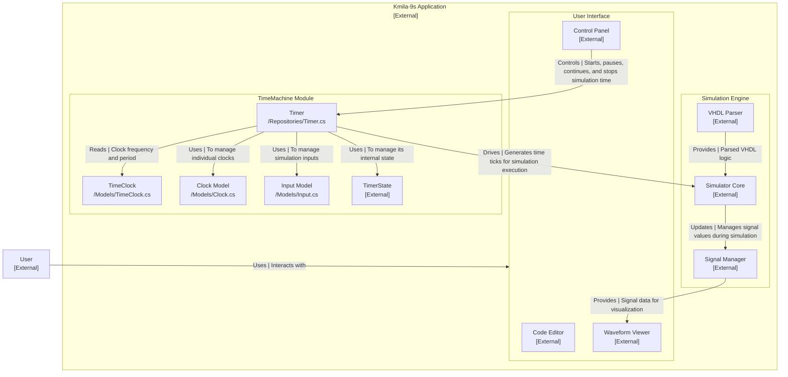

# Unnamed CodeViz Diagram

```mermaid
graph TD

    user["User<br>[External]"]
    subgraph kmila9s_boundary["Kmila-9s Application<br>[External]"]
        subgraph userInterface_boundary["User Interface<br>[External]"]
            codeEditor["Code Editor<br>[External]"]
            waveformViewer["Waveform Viewer<br>[External]"]
            controlPanel["Control Panel<br>[External]"]
        end
        subgraph simulationEngine_boundary["Simulation Engine<br>[External]"]
            vhdlParser["VHDL Parser<br>[External]"]
            simulatorCore["Simulator Core<br>[External]"]
            signalManager["Signal Manager<br>[External]"]
            %% Edges at this level (grouped by source)
            simulatorCore["Simulator Core<br>[External]"] -->|"Updates | Manages signal values during simulation"| signalManager["Signal Manager<br>[External]"]
            vhdlParser["VHDL Parser<br>[External]"] -->|"Provides | Parsed VHDL logic"| simulatorCore["Simulator Core<br>[External]"]
        end
        subgraph timeMachineModule_boundary["TimeMachine Module<br>[External]"]
            timerClass["Timer<br>/Repositories/Timer.cs"]
            timeClockClass["TimeClock<br>/Models/TimeClock.cs"]
            clockModel["Clock Model<br>/Models/Clock.cs"]
            inputModel["Input Model<br>/Models/Input.cs"]
            timerStateEnum["TimerState<br>[External]"]
            %% Edges at this level (grouped by source)
            timerClass["Timer<br>/Repositories/Timer.cs"] -->|"Reads | Clock frequency and period"| timeClockClass["TimeClock<br>/Models/TimeClock.cs"]
            timerClass["Timer<br>/Repositories/Timer.cs"] -->|"Uses | To manage individual clocks"| clockModel["Clock Model<br>/Models/Clock.cs"]
            timerClass["Timer<br>/Repositories/Timer.cs"] -->|"Uses | To manage simulation inputs"| inputModel["Input Model<br>/Models/Input.cs"]
            timerClass["Timer<br>/Repositories/Timer.cs"] -->|"Uses | To manage its internal state"| timerStateEnum["TimerState<br>[External]"]
        end
        %% Edges at this level (grouped by source)
        controlPanel["Control Panel<br>[External]"] -->|"Controls | Starts, pauses, continues, and stops simulation time"| timerClass["Timer<br>/Repositories/Timer.cs"]
        timerClass["Timer<br>/Repositories/Timer.cs"] -->|"Drives | Generates time ticks for simulation execution"| simulatorCore["Simulator Core<br>[External]"]
        signalManager["Signal Manager<br>[External]"] -->|"Provides | Signal data for visualization"| waveformViewer["Waveform Viewer<br>[External]"]
    end
    %% Edges at this level (grouped by source)
    user["User<br>[External]"] -->|"Uses | Interacts with"| userInterface_boundary["User Interface<br>[External]"]

```
---
*Generated by [CodeViz.ai](https://codeviz.ai) on 11/4/2025, 5:37:59 PM*
